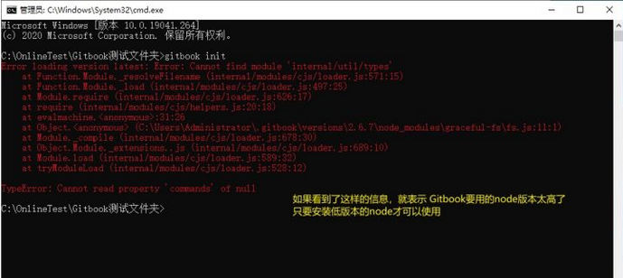

# Gitbook 下载安装

----------------------------------

## 安装 Node.js

GitBook 基于 Node.js，可以用来创建电子书，包括各种API文档、规范、指南等。

Node.js 下载地址：https://nodejs.org/zh-cn/  

### 查看 Node 版本

`node -v`

---

## 安装 GitBook

### 安装 gitbook-cli

gitbook-cli 是gitbook 的命令行的工具，通过它才能够安装gitbook，所以需要先安装它  
  
`npm install gitbook-cli -g`

### 安装 gitbook

```
gitbook fetch         // 安装最新版本
gitbook fetch 2.6.7   // 安装具体版本
```

#### 查看 gitbook 版本

```
gitbook -V  
gitbook ls
```

#### 多版本
>* 1.可以通过 `gitbook fetch xxxxx` 安装多个不同的版本
>* 2.如果没有特殊需求只安装 `2.6.7` 足以
>* 3.如果有多个版本，可通过 `gitbook -v 版本号` 指定运行对应的版本

---

## 安装失败

### 缓存异常
  偶尔也会出现上述操作解决不了的问题，譬如 npm 的缓存文件异常，就需要在安装前执行 `npm cache clean --force` 清空缓存目录 清空缓存目录

### node版本过高

如果输入 `gitbook init` 后，看到下图所示的红色信息，则表示 node 版本太高，经过测试 `gitbook2.6.7` 配合的node版本是小于 7 的，即可以 node6 的任意版本



