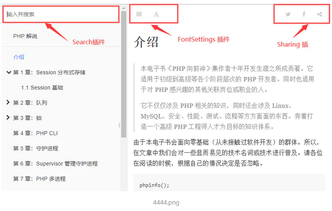

# 插件

----------------------------------

### 安装和删除插件

#### plugins 插件列表

通过 plugins 配置可以配置书籍需要的插件列表。

```
{
    "plugins": [
        "github",
        "splitter",
        ...
    ]
}
```

---

#### pluginsConfig 插件配置属性

通过插件配置可以配置插件列表 plugins 中对应插件的一些配置选项信息。

```
{
    "plugins": ["favicon"],
    "pluginsConfig": {
        "favicon": {
            "shortcut": "favicon.ico",
			      "bookmark": "favicon.ico"
        }
    }
}
```

---

#### 查找插件

[在 npm 搜索 gitbook](https://www.npmjs.com/)

---

#### 安装插件

安装插件有3中方法：

方法1：在book.json中添加相应插件和配置，然后执行 gitbook install 全部安装

方法2：使用 npm install pluginName 单独安装，然后写入配置

方法3：从源码GitHub地址中下载，放到 node_modules 文件夹里，（GitHub地址在进入插件地址右侧的GitHub链接）

---

#### Gitbook 自带插件

Gitbook默认带有5个插件：
>* highlight：代码高亮
>* search：导航栏查询功能（不支持中文）
>* sharing：右上角分享功能
>* font-settings：字体设置（左上方的"A"符号）
>* livereload：为 GitBook 实时重新加载



---

#### 删除自带插件

系统自带插件可通过 在插件名前面加减号的方式去除掉，如-sharing

```json
"plugins": [
    "-search"
]
```
