# 常用插件

----------------------------------

## 网站主题

### theme-fexa 

功能：  
1.添加标题（头部导航）
2.添加搜索框，取消了左侧的搜索 
3.目录栏样式设置  
4.页面左边距设置  
5.添加右侧章节目录  
6.去掉gitbook-link

缺点：  
1.只显示到3级标题（是否是设置问题）
2.章节目录超出界面，会出现滚动条，但是为啥会出现在页面的外面？？？
3.章节目录无法左移，右侧多出的内容看不见~~

[GitHub 地址](https://github.com/tonyyls/gitbook-plugin-theme-fexa)

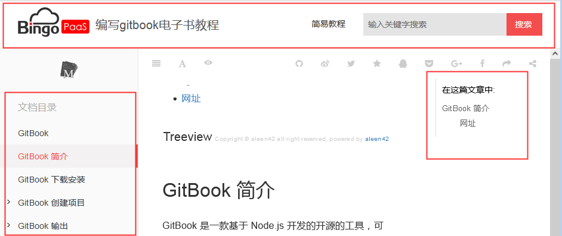

<h5>插件配置</h5>

```css
{
    "plugins": [
        "theme-fexa"
    ],
    "variables": {
        "themeFexa":{
            "nav":[     // 这里添加导航链接
                {
                    "url":"http://...",
                    "target":"_blank",
                    "name": "简易教程"
                }
            ]
        },
    },
    "pluginsConfig": {
        "theme-fexa":{
            "search-placeholder":"输入关键字搜索", //搜索框提示信息
            "logo":"./logo.png", //logo地址
            "favicon": "./favicon.ico" //ico地址
        }
    }
}
```

---

### theme-bookstyle

同 theme-fexa 插件  

有关 gitbook 主题的插件可以在[npm](https://www.npmjs.com/)上搜索gitbook-plugin-theme 关键字

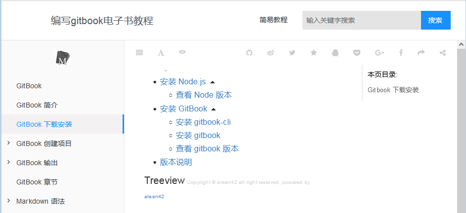

<h5>插件配置</h5>

```css
}
    "variables": {
        "themeFexa": {
            "nav": [
                {
                    "url": "http://...",
                    "target": "_blank",
                    "name": "test"
                }
            ]
        }
    },
    "pluginsConfig": {
        "theme-bookstyle": {
            "search-placeholder": "输入关键字搜索",
            "logo": "./logo.png",
            "favicon": "./favicon.ico"
        }
    }
}
```

---

### theme-comscore 主题插件

修改标题和表格颜色

---

## 评论插件

### valine

需要注册账号并获取appID和appKey

[官网](https://valine.js.org/quickstart.html)

<h5>插件配置</h5>

```css
"valine": {
    "appId": "your appId",
    "appKey": "your appKey"
}
```

---

### Gitalk

[链接](https://segmentfault.com/a/1190000019806829?utm_source=tag-newest)

---

## 添加目录/回到顶部

|名称               |功能                |状态    |备注|
|------------------|--------------------|--------||
| page-treeview    | 创建页面目录       | 好用   || 
| simple-page-toc  | 生成本页目录       | 安装失败 ||
| anchor-navigation-ex | 悬浮按钮目录 |不好用| 只显示1、2、3级标签|
| page-toc-button| 生成悬浮页内目录 | 不好用 |||
| ancre-navigation  | 悬浮目录和回到顶部 | 好用 ||
| back-to-top-button| 添加回到顶部按钮 |好用||

### page-treeview 创建页面目录

page-treeview 插件用于创建页面目录，所有 1# 到 6# 的标题都会被收录  
不需要在文档中插入标签，能够支持到 6 级目录，安装即可用。

[GitHub 地址](https://github.com/aleen42/gitbook-treeview)

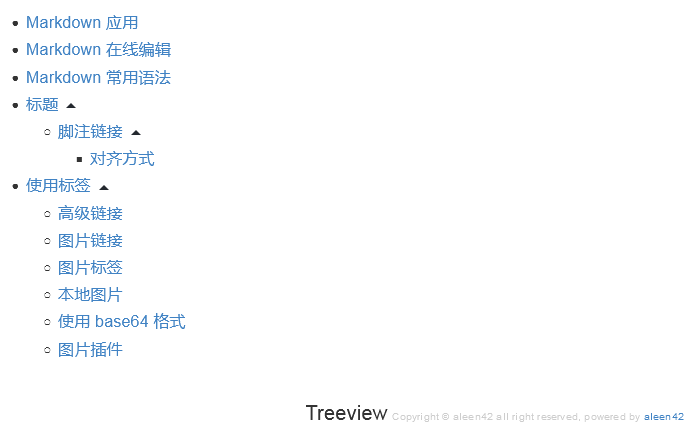


<h5>插件配置</h5>

```css
"pluginsConfig": {
    "page-treeview": {
        "copyright": "Copyright &#169; aleen42",
        "minHeaderCount": "2",
        "minHeaderDeep": "2"
    }
}
```

#### 删除文字提示

方法1：  
这个插件生成目录以后，下面有一行关于版权的文字。  
这行文字可以通过样式来进行控制，让它不显示出来。

```css
.treeview__container {
    margin-bottom: 0px !important;
}
.treeview__container-title {
    display: none !important;
}
```

方法2：
```
找到插件目录下的index.js文件：***/node_modules/  gitbook-plugin-page-treeview/lib/index.js  
找到大约111行，删除这一行关于var copyRight的定义  
下面113行的var insertTreeview中，删除+ copyRight，目前就不显示了  
142行中的'copyright': 'Copyright &#169; aleen42',也可以删除  
下面161行和163行和111行113行一样的，其实不删除也不显示了。  
但是以后执行gitbook install就恢复了。
```

---

### anchor-navigation-ex 悬浮按钮目录(只显示1、2、3级标签)

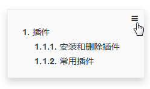

页面右上角生成一个灰色的目录按钮，鼠标移入后会显示灰色的目录。  
页面右下角生成一个灰色的箭头按钮，用于返回第一个 `H1`标签。

<h5>插件配置</h5>

```css
"pluginsConfig": {
    "anchor-navigation-ex": {
        "showLevel": false, //标题是否显示层级序号.页面标题和导航中的标题都会加上层级显示。
        "showGoTop": false // 是否显示返回顶部按钮
    },
}
```

[参数设置](https://github.com/zq99299/gitbook-plugin-anchor-navigation-ex/blob/master/doc/config.md)

---

### page-toc-button 生成悬浮页内目录

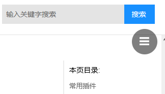

<h5>插件配置</h5>

```css
"page-toc-button": {
    "maxTocDepth": 2,
    "minTocSize": 2
}
```

<h5>参数说明</h5>

<table><thead><tr><th>名称</th><th>默认</th><th>描述</th></tr></thead><tbody><tr><td>maxTocDepth</td><td>2</td><td>标题的最大深度&#xff08;2 &#61; h1 &#43; h2 &#43; h3&#xff09;。不支持值&gt; 2。</td></tr><tr><td>minTocSize</td><td>2</td><td>显示toc按钮的最小toc条目数。</td></tr></tbody></table>

---

### ancre-navigation 悬浮目录+回到顶部

添加Toc到侧边悬浮导航以及回到顶部按钮。  
比 page-toc-button 好用。  

**注意：**  
>* 1.本插件只会提取 h[1-3] 标签作为悬浮导航
>* 2.必须要以 h1 开始，直接写 h2 不会被提取

---

### back-to-top-button 添加回到顶部按钮

**回到最顶部，浏览器滚动条边距为0**

[GitHub 地址](https://github.com/stuebersystems/gitbook-plugin-back-to-top-button)


---

## 添加页脚

### tbfed-pagefooter 页面添加页脚（简单版）

在每个页面的最下方自动添加页脚信息，可用于在页面显示最后更新时间

[GitHub 地址](https://github.com/zhj3618/gitbook-plugin-tbfed-pagefooter)

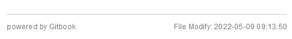


<h5>插件配置</h5>

```css
"tbfed-pagefooter": {
    "copyright": "Copyright © levywang123@gmail.com 2020",
    "modify_label": "该文章最后修订时间：",
    "modify_format": "YYYY-MM-DD HH:mm:ss"
},
```

---

### page-copyright 页面添加页脚（复杂版）

[GitHub 地址](https://github.com/skyFi/gitbook-plugin-page-footer)

在每个页面的最下方自动添加页脚配置的各个信息


<h5>插件配置</h5>

```css
"page-copyright": {
    "description": "footer",
    "copyright": "Copyright  levywang123@gmail.com 2020",
    "timeColor": "#ccc",
    "copyrightColor": "#ddd",
    "utcOffset": "8",
    "style": "normal",
    "noPowered": false,
    "signature": "levy",
    "wisdom": "footer",
    "format": "YYYY-MM-dd hh:mm:ss",
},
```

---

## 代码应用

### code 行号+复制

为代码块添加行号和复制按钮，复制按钮可关闭

[GitHub 地址](https://github.com/TGhoul/gitbook-plugin-code)

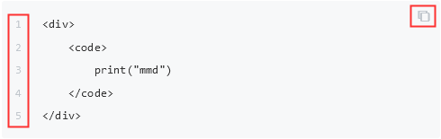

<h5>插件配置</h5>

```css
"code": {
    "copyButtons": false
}
```

---

### copy-code-button 只有复制

---

### klipse 代码IDE交互（测试不好用）

---

## 代码高亮

### highlight

highlight 是 gitbook 自带的插件  
`gitbook-plugin-highlight` 使用 `highlight.js` 作为后台渲染引擎，`highlight.js` 支持的语言及简写可在[官方手册](highlightjs.readthedocs.io/en/latest/css-classes-reference.html#language-names-and-aliases)中查看。


### prism 代码颜色插件

此插件需要禁用 gitbook 自带的 `highlight` 插件  

prism 支持的语言可在其[官方网站](https://prismjs.com/#languages-list)查询

<h5>插件配置</h5>

```css
"prism": {
    "css": [
        "prismjs/themes/prism-solarizedlight.css"
    ]
}
```

---

## 目录折叠

|插件名称|功能|状态|备注|
|---|---|---|---|
|chapter-fold|左侧目录折叠|OK|1.有折叠箭头。2.有互斥|
|expandable-chapters|左侧目录折叠|不好用|1.有大箭头。2.无互斥|
|expandable-chapters-small|左侧目录折叠|不好用|1.有折叠箭头。2.无互斥|
|toggle-chapters|左侧目录折叠|最不好用|1.无箭头。2.无互斥|

---

### chapter-fold 导航目录折叠

1.支持多层目录，点击导航栏的标题名就可以实现折叠扩展。  
2.有箭头，有互斥

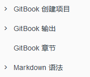

---

## 常用功能

### pageview-count 阅读量计数 （测试失败）

记录每个文章页面被访问的次数。

---

### edit-link 添加编辑页面按钮

单击编辑按钮可以跳转到**GitHub**进行编辑


---

### sharing-plus 分享插件

gitbook默认只有Facebook、Google、Twiter、Weibo、Instapaper

sharing-plus 插件可以有更多分享方式，也可以关闭指定分享方式。

**需要将自带的插件给隐藏掉 -sharing**

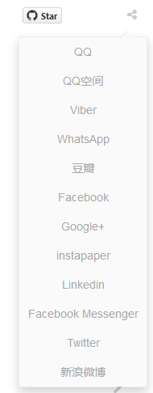

<h5>插件配置</h5>

```css
"sharing": {
           "douban": false,
           "facebook": false,
           "google": true,
           "hatenaBookmark": false,
           "instapaper": false,
           "line": true,
           "linkedin": true,
           "messenger": false,
           "pocket": false,
           "qq": false,
           "qzone": true,
           "stumbleupon": false,
           "twitter": false,
           "viber": false,
           "vk": false,
           "weibo": true,
           "whatsapp": false,
           "all": [
               "douban", "facebook", "google", "hatenaBookmark", 
               "instapaper", "linkedin","twitter", "weibo", 
               "messenger","qq", "qzone","viber","vk","weibo",
               "pocket", "stumbleupon","whatsapp"
           ]
       }
```

说明：  
为true的代表直接显示在页面顶端，为false的不显示，不写默认为false  
"all"中代表点击分享符号显示出来的  
支持的网站有：  
```
  "douban", "facebook", "google", "hatenaBookmark", 
  "instapaper", "linkedin","twitter", "weibo", 
  "messenger","qq", "qzone","viber","vk","weibo",
  "pocket", "stumbleupon","whatsapp"
```


#### 分享到其他网站

[分享到其他网站](https://www.cnblogs.com/mingyue5826/p/10307051.html)

1. 查看 URL 链接  
2. 修改 button.js  
3. 修改 package.json  

---

### donate 打赏插件

配置打赏模块，在每篇文章底部都会加上一个按钮，点击显示图片


<h5>插件配置</h5>

```css
"donate": {
    "wechat": "/assets/img/donate/wechat.png",
    "alipay": "/assets/img/donate/alipay.png",
    "title": "",
    "button": "赏",
    "alipayText": "支付宝打赏",
    "wechatText": "微信打赏"
}
```

---

### search-pro 高级搜索

支持中英文，准确率更高一些。

**需要将默认的search和lunr 插件去掉**

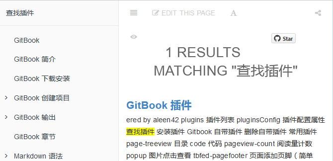

---

### search-plus 中文搜索

原搜索插件不支持中文搜索，所以使用该插件进行替换。需要将原插件进行去除掉

<h5>插件配置</h5>

```css
"plugins": [ "search-plus", "-lunr", "-search"]
```

---

### splitter 侧边栏宽度调整

[GitHub 地址](https://github.com/yoshidax/gitbook-plugin-splitter)

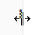

添加完插件后，在界面上 侧边栏可自行调整宽度

---

### auto-scroll-table 表格滚动条

为避免表格过宽，增加滚动条,如果表格宽度不够，是不显示滚动条的

---

## 图标/图片

### change_girls 可自动切换的背景

饱和度很淡

<h5>插件配置</h5>

```css
"change_girls" : {
    "time" : 10,
    "urls" : [
        "girlUrl1", "girlUrl2",...""
    ]
}
```

<h5>参数说明</h5>

>* time：图片的切换时间，单位是秒
>* urls： 一个数组，可以定义多个图片，只能使用互联网上的绝对地址

---

### popup 图片点击查看，显示大图

插件用于点击图片时，打开新的网页用来查看高清大图

[GitHub 地址](https://github.com/somax/gitbook-plugin-popup)

---

### lightbox 图片点击查看，大小不变

---

### favicon 修改图标（未测试）

修改网页标题的图标，显示个性化 ico

<h5>插件配置</h5>

```css
"favicon": {
    "shortcut": "assets/favicon.ico",
    "bookmark": "assets/favicon.ico",
    "appleTouch": "assets/favicon.ico",
    "appleTouchMore": {
        "120x120": "assets/favicon.ico",
        "180x180": "assets/favicon.ico"
    }
},
```

---

### insert-logo 插入logo

在左侧导航栏上方插入logo。

url支持本地图片也支持网络图片链接


<h5>插件配置</h5>

```css
"insert-logo": {
    "url": "images/tupian.png",
    "style": "background: none; max-height: 30px; min-height: 30px"
}
```

---

### custom-favicon 修改标题栏图标

设置浏览器选项卡标题栏的小图标。

**注意只支持ico后缀的图片，并且只支持本地图片，不支持网络图片链接。**


<h5>插件配置</h5>

```css
"favicon": "icon/favicon.ico"
```

---

### advanced-emoji 支持 emoji 表情

`:bowtie:`


[表情查询](https://www.webfx.com/tools/emoji-cheat-sheet/)


---

### github-buttons 按钮


<h5>插件配置</h5>

```css
"github-buttons": {
  "repo": "darrenliuwei/gitbook",
  "types": ["star"],
  "size": "small"
},
```

---

### github 图标

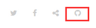

<h5>插件配置</h5>

```css
"github": {
    "url": "https://github.com/zhangjikai"
}
```

---

## 显示隐藏

### hide-element 隐藏界面元素

主要用来隐藏不想看到的元素。

默认的gitbook左侧提示：Published with GitBook**（测试没效果）**

[GitHub 地址](https://github.com/gonjay/gitbook-plugin-hide-element)


<h5>插件配置</h5>

```css
"hide-element": {
    "elements": [".gitbook-link"]
}
```
---

### sectionx 面板显示隐藏（未测试）

[sectionx](https://www.cnblogs.com/mingyue5826/p/10307051.html)

效果比 accordion 差

---------------------------------------

### accordion 折叠模块

这个插件名叫手风琴，可以实现将内容隐藏起来，外部显示模块标题和显示箭头，点击箭头可显示里面的内容。

```
%accordion%模块标题%accordion%
内容部分
%/accordion%
```

%accordion%模块标题%accordion%

内容部分

%/accordion%

[连接]（https://segmentfault.com/a/1190000019806829?utm_source=tag-newest）

---------------------------------------

## 警报

### alerts

```
> **[info] For info**
> Use this for infomation messages.
> **[warning] For warning**
> Use this for warning messages.
> **[danger] For danger**
> Use this for danger messages.
> **[success] For success**
> Use this for success messages.
```

> **[info] For info**
> Use this for infomation messages.

---

> **[warning] For warning**
> Use this for warning messages.

---

> **[danger] For danger**
> Use this for danger messages.

---

> **[success] For success**
> Use this for success messages.

---------------------------------------

### flexible-alerts

```
> [!NOTE]
> 这是一个简单的Note类型的使用，所有的属性都是默认值。
> [!TIP]
> 这是一个简单的Note类型的使用，所有的属性都是默认值。
> [!WARNING]
> 这是一个简单的Note类型的使用，所有的属性都是默认值。
> [!DANGER]
> 这是一个简单的Note类型的使用，所有的属性都是默认值。
```

> [!NOTE]
> 这是一个简单的Note类型的使用，所有的属性都是默认值。

---

> [!TIP]
> 这是一个简单的Note类型的使用，所有的属性都是默认值。

---

> [!WARNING]
> 这是一个简单的Note类型的使用，所有的属性都是默认值。

---

> [!DANGER]
> 这是一个简单的Note类型的使用，所有的属性都是默认值。

---

**语法：**  
```
> [!type|style:xx|label:xx|icon:xx|className:xx|labelVisibility:xx|iconVisibility:xx]
> 内容部分
```

<h5>字段设置</h5>

字段介绍，如果不设置的表示选择默认，除了!type都不是必需

|键	|允许的值|说明|
|:---|:---|:---|
|!type	|NOTE，TIP，WARNING和DANGER	|警告级别设置|
|style	|以下值之一: callout（默认）, flat	|警告样式，见图19的左右不同|
|label	|任何文字	|警告块的标题位置，即Note这个字段位置（不支持中文）|
|icon	|e.g. 'fa fa-info-circle'	|一个有效的Font Awesome图标，那块小符号|
|className	|CSS类的名称	|指定css文件，用于指定外观|
|labelVisibility	|以下值之一：visible（默认），hidden	|标签是否可见|
|iconVisibility	|以下值之一：visible（默认），hidden	|图标是否可见|

**效果图：**  

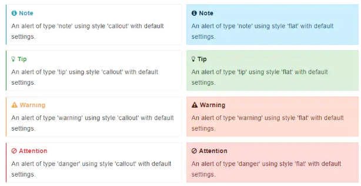

<h5>参数设置</h5>

**自定义设置不是必需的**  

```css
"flexible-alerts": {
    "style": "callout",
    "comment": {
        "label": "Comment",
        "icon": "fa fa-comments",
        "className": "info"
    }
}
```
---

## 其他插件

### url-embed 插入外部页面

可向页面中添加一个窗口，显示其他页面

<h5>参数设置</h5

```json

https://website.org/stuff/this-is-the-path-name

```

---

### 添加参考文献

[插件](https://www.bookstack.cn/read/yangzh-gitbook/53e61bb461cd65ae.md)

---

### 添加测验功能

[插件](https://www.bookstack.cn/read/yangzh-gitbook/90a19bdba95c6602.md)

--- 

```
exercises，在文档中增加交互练习内容，目前只支持js语言。
quiz，在文档中增加测验内容，支持单选、多选、排序。
include-codeblock，使得GitBook能引用外部独立文档。
localized-footer，为GitBook的每个页面添加页脚内容。
page-footer-ex，为文档添加修改时间和版权声明页脚。
changyan，为GitBook页面添加畅言评论框。
iframely, 在页面中嵌入常见视频网站内容。
bibtex-indexed-cite，使用bibtex格式，自动生成参考文献。
```