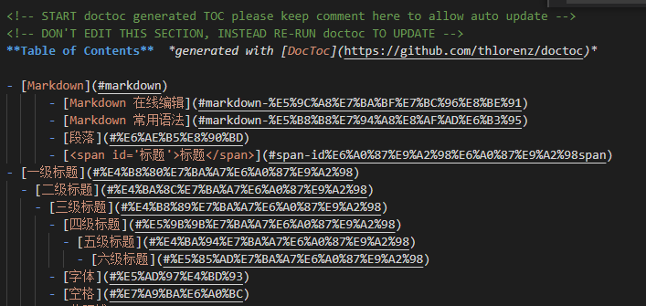

# 生成本页目录

----------------------------------

#### 手动生成

##### 方法1：使用 markdown 语法添加链接

```
目录
- 一、[链接1](#index1)
- 二、[链接2](#index2)

- <span id='index1'>这是链接1</span>
- <span id='index2'>这是链接2</span>
```

目录
- 一、[链接1](#index1)
- 二、[链接2](#index2)

- <span id='index1'>这是链接1</span>
- <span id='index2'>这是链接2</span>

***

##### 方法2：使用 html a 标签添加链接

```
目录
- 一、<a href='#link3'>链接3</a>
- 二、<a href='#link4'>链接4</a>

- <span id='link3'>这是链接3</span>
- <span id='link4'>这是链接4</span>
```

目录
- 一、<a href='#link3'>链接3</a>
- 二、<a href='#link4'>链接4</a>

- <span id='link3'>这是链接3</span>
- <span id='link4'>这是链接4</span>

***

#### 自动生成

##### 方法1：使用[toc]

在文章中输入 [toc]，即可在对应位置插入目录，凡是文章标题带有#（1-6个）的都会被捕获到目录中  
  
注意：不是对所有的markdown模板都通用

***

##### 方法2：使用 doctoc 插件

##### 安装 doctoc

`npm i doctoc -g`

##### 执行命令：

在需要生成目录的 .md 文件夹下进入 CMD，输入命令

`doctoc 文件名.md`

##### 提示：  
```
DocToccing single file "markdown自动生成目录.md" for github.com.

==================

"markdown 自动生成目录.md" will be updated

Everything is OK.
```

**在指定的.md文件的头部就会出现目录，但是链接好像挂掉了~~~**



***

##### 方法3：使用 page-treeview 插件

