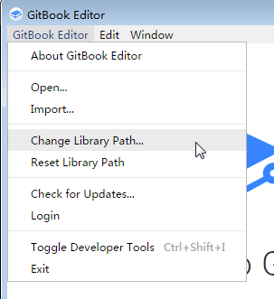
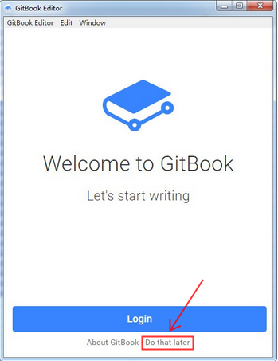
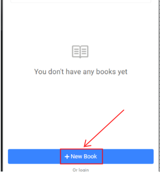
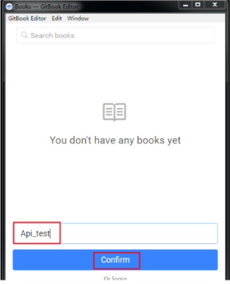
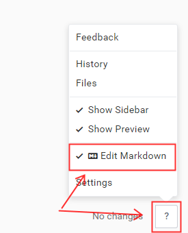

# GitBookEditor

---

**GitBook** 官方客户端编辑器，支持 Win、Linux、Mac 系统。

---

## 下载安装

[下载地址](https://www.liqucn.com/rj/75340.shtml)  

下载后得到一个.zip 格式的文件，解压后为.exe文件，双击打开即可

---

## 更改保存地址

点击 "GitBook Editor"  - "change library path" 更改保存地址

---

## 创建项目

在登录窗口依次点击 "Do that later" — "+New Book" - "输入项目名称" - "Confirm"

---

## 使用 Markdown 编辑

击右下脚 “？” 按钮，选择 Markdown 编辑模式 ，右侧会出现预览窗口

---

## 页面跳转

如果生成的静态文件无法跳转，那时因为 gitbook3.0 以后不支持本地预览
	
**解决方法：**   

**1、修改js文件**  
  1.找到项目目录下的theme.js文件  
  2.将if(m)改成if(false)   
  3.提示：定位代码位置直接搜索： if(m)for(n.handler&&  
	
这样修改又有一个问题：字体大小和隐藏目录按钮失效。

**2、生成指定版本的gitbook**  
  -gitbook build --gitbook=2.6.7  
  系统会自动下载2.6.7版本。2.6.7版本依赖nodejs6，要确保nodejs是6版本。  

---
