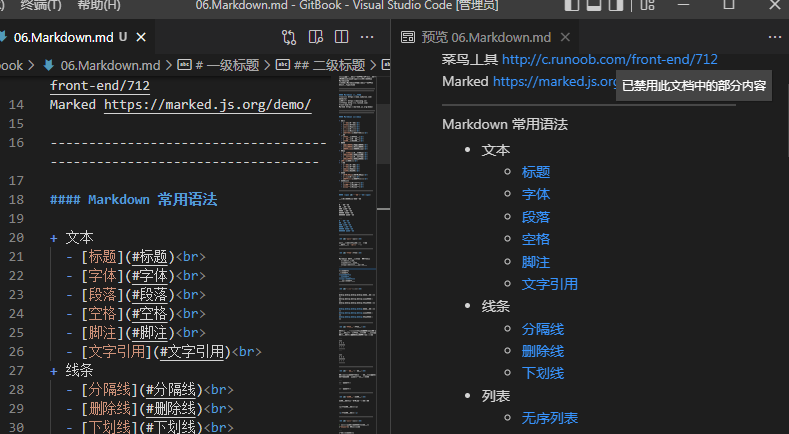
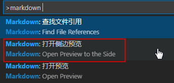

# VS Code 开启对 Markdown 实时预览

----------------------------------

在VSCode中安装插件可以实现对.md文件的实时预览

**方法1：markdown**

1.用 VS code 打开 .md 文件  
2.按 F1 输入 markdown 选择下图的选项即可 

**如果查找不到，查看[链接](https://blog.csdn.net/qq_45717425/article/details/118902250)**

***

**方法2：Office Viewer(Markdown Editor)**

[链接](https://blog.csdn.net/LittleCAIyuan/article/details/123521972?spm=1001.2101.3001.6661.1&utm_medium=distribute.pc_relevant_t0.none-task-blog-2%7Edefault%7ECTRLIST%7ERate-1-123521972-blog-118902250.pc_relevant_antiscanv2&depth_1-utm_source=distribute.pc_relevant_t0.none-task-blog-2%7Edefault%7ECTRLIST%7ERate-1-123521972-blog-118902250.pc_relevant_antiscanv2&utm_relevant_index=1)

