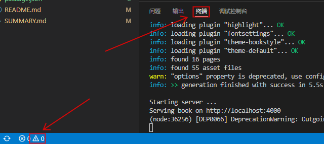
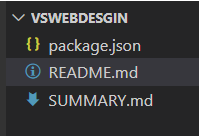
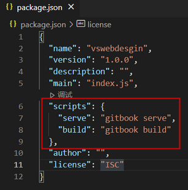
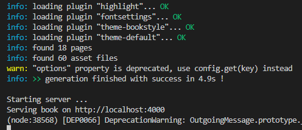

# VS Code 运行 Gitbook

---

### 打开终端

***

### 初始化配置

1.在vscode终端里输入npm init，然后一直空格直到出现完yes

成功后出现以下这个json文件

2.更改文件代码并保存

{
  "name": "vswebdesgin",
  "version": "1.0.0",
  "description": "",
  "main": "index.js",
  "scripts": {
    "serve": "gitbook serve",
    "build": "gitbook build"
  },
  "author": "",
  "license": "ISC"
}

3.运行服务

npm run serve

