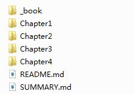
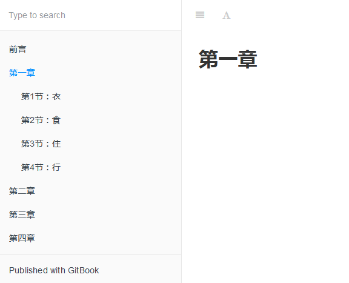

# 根据项目目录创建项目文件

---

1.新建项目文件夹，并使用 gitbook init 创建项目

2.在 SUMMARY.md 文件下输入目录

```Markdown
# Summary

* [前言](README.md)
* [第一章](Chapter1/README.md)
    * [第1节：衣](Chapter1/衣.md)
    * [第2节：食](Chapter1/食.md)
    * [第3节：住](Chapter1/住.md)
    * [第4节：行](Chapter1/行.md)
* [第二章](Chapter2/README.md)
* [第三章](Chapter3/README.md)
* [第四章](Chapter4/README.md)
```

3.在项目文件夹下再执行一次 gitbook init，此时项目会根据 SUMMARY.md 下的目录列表创建对应的项目文件



