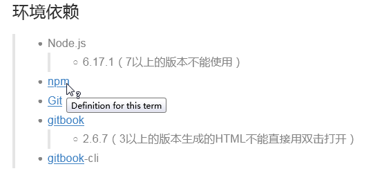

# 添加专业术语

---

将一些专业名词，名词或者术语的解释配置定义在文件中，在书籍中使用到对应专业术语的地方就可以链接到专业解释的地方。  

在 Gitbook 中使用 `GLOSSARY.md` 来进行专业术语列表的配置   

**定义专业术语：**  
>* 定义的方式是在 `GLOSSARY.md` 使用 `##` 列表来定义专业术语的列表。
>* 术语为二级标题，只支持英文术语

**实例：**  

步骤一：在项目文件下新建一个 `GLOSSARY.md` 文件，并添加专业术语的描述信息

```
## npm
Definition for this term

## Git
Definition for this term

## markdown
Markdown是一种轻量级标记语言，创始人为约翰·格鲁伯（英语：John Gruber）。 
它允许人们使用易读易写的纯文本格式编写文档，然后转换成有效的XHTML（或者HTML）文档。
这种语言吸收了很多在电子邮件中已有的纯文本标记的特性。

## gitbook
GitBook 是一个基于 Node.js 的命令行工具，可使用 Github/Git 和 Markdown 来制作精美的电子书。

## Term
Definition for this term

## Another term
With it's definition, this can contain bold text
and all other kinds of inline markup ...
```

步骤二：使用专业术语在文档中直接输入对应的术语即可

```
>* Node.js
  >>* 6.17.1（7以上的版本不能使用）
>* npm
>* Git
>* gitbook
  >>* 2.6.7（3以上的版本生成的HTML不能直接用双击打开）
>* gitbook-cli
```

**查看效果**

有专业术语的链接会有相应的提示（字体蓝色、下划线），将鼠标放在链接上，会有相应的提示，单击也可跳转到术语定义列表


